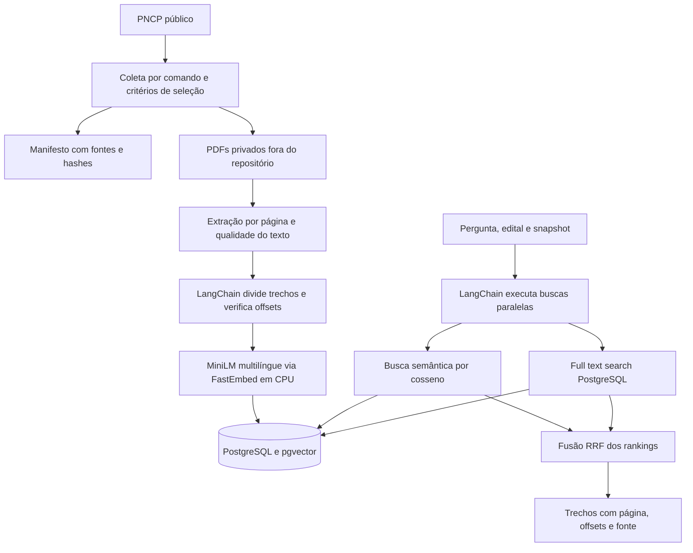
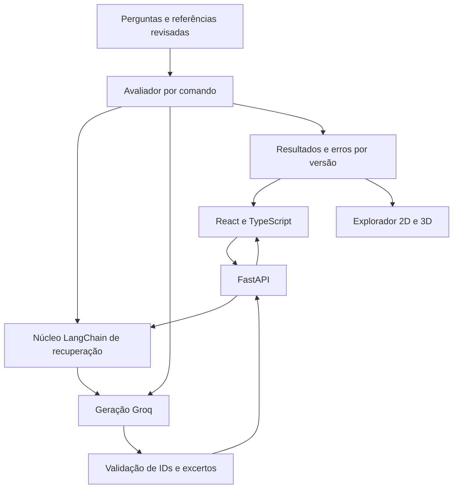

# Arquitetura — Radar de Editais

Atualização: 2026-10-01. Laboratório de avaliação de RAG para pequenos fornecedores de computadores, monitores e acessórios. LangChain coordena o núcleo, PostgreSQL/pgvector armazena e busca, Groq será o provedor de geração. Dify permanece opção futura.

## Estado

| Camada | Estado |
|---|---|
| Coleta PNCP, manifesto, extração, embeddings e carga | Implementados |
| Busca híbrida, filtros e citações de trechos | Implementados; não há resposta gerada |
| Ampliação de 10 para 30 editais em vários estados | Preparação, carga e restauração verificadas; evidências em reports/ |
| Perguntas de referência e avaliação de qualidade | Planejadas, exigem revisão humana |
| Geração Groq e validação de citações | Planejadas; modelo específico a definir |
| API FastAPI e interface React/TypeScript | Planejadas |
| Explorador de recuperação 2D/3D | Direção aprovada, ainda não implementado |

## Fluxo implementado

As caixas representam responsabilidades de um backend modular, não microserviços separados.

## Componentes e escolhas

| Componente | Papel e motivo | Limitação |
|---|---|---|
| Python e CLI | Mesmo núcleo para coleta, carga, consulta e futura avaliação; comandos reproduzíveis. | API e interface ainda inexistentes. |
| LangChain | Documentos e embeddings padronizados, splitter e RunnableParallel para coordenar buscas e fusão. | Não garante qualidade de extração ou apoio de respostas. |
| pypdf e FontTools | Extração por página com suporte às fontes encontradas. | Sem OCR ou reconstrução robusta de tabelas. |
| FastEmbed/ONNX, MiniLM multilíngue | Embeddings locais de 384 dimensões em CPU, sem chamadas de geração. | Janela de 128 tokens; qualidade será medida. |
| PostgreSQL/pgvector | Metadados, texto e vetores juntos; busca exata evita ajuste prematuro de índices aproximados. | Banco necessário; escalabilidade futura exige medição. |
| Manifestos e snapshots | Fontes, datas e hashes preservam versões dos experimentos. | Não é acompanhamento em tempo real da vigência. |
| Groq | Provedor futuro, conectado por adaptador LangChain. | Modelo, permissões, preços e limites precisam ser conferidos antes da execução. |

Dify não entra nesta versão. Sua adoção posterior exigirá definir quem controla recuperação, prompt, geração e métricas.

## Dados e preparação

- snapshots: manifesto e configuração imutáveis após carga.
- documents: contratação, sequência do anexo, hash e fonte.
- pages: texto por página física e indicador de qualidade.
- chunks: texto, offsets, página e vetor de 384 dimensões.

Trechos têm até 120 tokens e sobreposição de 20. Offsets são conferidos por substring. Páginas com pouco texto ficam preservadas e sinalizadas, sem concluir ausência de informação. PDFs e textos podem conter dados pessoais: originais, extração, modelos, vetores, senhas e backups ficam fora do repositório.

Hashes dos arquivos do modelo são registrados. Vetores anteriores só são reutilizados com configuração igual e fingerprint íntegro; novos vetores têm checkpoints privados. Carga é transacional e repetição do mesmo snapshot não duplica dados.

Tipo de anexo informado pela API pode divergir do conteúdo. Não presumir que o primeiro documento é o edital, que active comprova vigência ou que uma retificação substitui todas as condições. Referências de avaliação exigem revisão humana.

## Recuperação

As duas buscas filtram snapshot e edital antes de ordenar. Semântica usa distância cosseno; textual usa tsvector português/simple e websearch_to_tsquery. Isso é full text search PostgreSQL, não BM25.

Cada modalidade traz até dez candidatos. Reciprocal Rank Fusion combina posições com constante 60 e retorna cinco resultados, deduplicados por ID. Parâmetros são a baseline, ainda sem validação de qualidade.

Limitação observada: pergunta longa pode retornar zero candidatos lexicais por AND restritivo. Similaridade alta, existência de citação ou posição no mapa não comprovam apoio a uma resposta.

## Fluxo futuro

CLI, API futura e avaliador usarão o mesmo núcleo. Documentos são dados não confiáveis e não controlam o sistema. Validar IDs não comprova que citações sustentam conclusões: critérios e revisão humana examinam esse vínculo.

## Avaliação e 3D

Planejadas: Hit@k e Recall@k, afirmações sem apoio, correção/completude e recusa correta, latência p50/p95 e custo pelo uso reportado/preços na data da execução. Separar ingestão, consulta e avaliação. Mesmo corpus e perguntas por comparação, um fator alterado por experimento e casos reservados.

O explorador deve ajudar a investigar recuperados versus referências, possíveis repetições e casos de erro. Comparar 2D/3D com tarefas verificáveis, PCA como referência e UMAP como alternativa. Busca usa os vetores originais, não coordenadas projetadas. [Plano e limites](visualizacao-3d.md). Nenhuma métrica de qualidade ou benefício do 3D foi medida.

## Operação e segurança

Compose exclusivo, loopback 55432, rede/volume próprios, banco com 768 MiB e 1 CPU; imagem fixada por digest. Senhas aleatórias privadas montadas como secrets, carregador sem superuser/CREATEDB/CREATEROLE. Tracing externo desativado. Isolamento não elimina competição por recursos da máquina.

Downloads restritos ao PNCP em HTTPS com limites; SQL parametrizado. API pública futura exige autenticação/autorização, quotas, papel somente leitura, revisão de prompt injection e HTTPS. Scanner de CVEs da imagem, política de retenção e redistribuição dos PDFs permanecem pendentes.

[Operação](base-e-operacao.md), [segurança desta atualização](../reports/seguranca-2026-10-01.md) e reports contêm evidências e limitações.

## Referências

- [PNCP API](https://pncp.gov.br/api/consulta/swagger-ui/index.html)
- [pgvector](https://github.com/pgvector/pgvector)
- [PostgreSQL full text search](https://www.postgresql.org/docs/current/textsearch.html)
- [MiniLM multilíngue](https://huggingface.co/sentence-transformers/paraphrase-multilingual-MiniLM-L12-v2)
- [LangChain ChatGroq](https://docs.langchain.com/oss/python/integrations/chat/groq)
