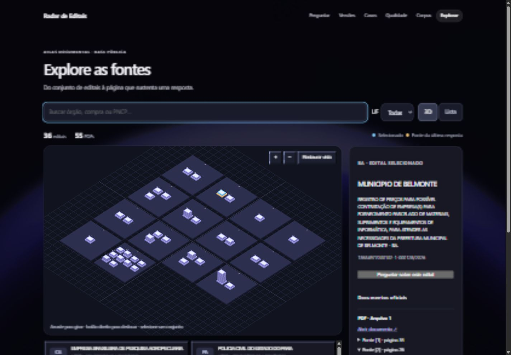

# Guardrails, confiança e atlas 3D — 2026-10-05

## Entrega para revisão de Renê

Pedido: implementar controles do RAG e adaptar a interação 3D do vídeo ao Radar, sem copiar cenário ou ativos. Implementação local; API permanece em loopback com geração habilitada. Nenhum push/publicação realizado. Holdout não executado.

### Guardrails e confiança

`guardrails.py` bloqueia padrões explícitos de pedido para ignorar regras, fabricar fontes ou expor segredos antes da descoberta/Groq. Detecta alguns comandos dirigidos ao assistente nos trechos recuperados e interrompe a geração. Não é detector universal: paráfrases, ofuscação e falsos positivos continuam possíveis. Perguntas administrativas comuns continuam permitidas nos testes.

Após a validação literal existente, confere números de cada afirmação contra as próprias passagens citadas. Número ausente transforma a saída em evidência insuficiente, sem afirmações/fontes factuais. Essa regra não comprova que o número pertence ao item certo, mantém a unidade correta ou preserva qualificadores. Não promove prompt v3 nem altera os relatórios históricos.

Contrato público acrescenta confiança em dois estados: sem resposta factual validada ou fontes verificadas/interpretação a conferir. Inclui motivo e indicação de seleção manual/automática do escopo, com calibrated=false. Tela mostra critérios em detalhe expansível, sem porcentagem ou rótulo de alta precisão inventado. Não há detecção completa de contradições nem calibração estatística.

### Reranking implementado como experimento

`rerank_documents` reordena as mesmas passagens já selecionadas pelo núcleo híbrido/estrutura de itens. Prioriza identidade de item explicitamente informado e cobertura de palavras da pergunta, com desempate pela ordem anterior. Não é cross-encoder neural; não chama outro provedor, não usa respostas de referência e não adiciona/exclui passagens.

Comparação pareada reproduzível: `.venv/Scripts/python.exe ops/verify-chat-reranking.py`, com RADAR_PRIVATE_ROOT configurado. [Relatório](../reports/chat-reranking-2026-10-05.json): 40 perguntas factuais aprovadas de desenvolvimento, banco/embeddings reais, zero Groq e zero holdout. Todas as evidências esperadas presentes em 38/40 antes/depois; ao menos uma em 39/40. MRR 0,84375 → 0,845833; duas posições melhoraram e duas pioraram. Mediana de reordenação 0,835 ms nesta execução, sem garantia de desempenho futuro.

Decisão: experimento disponível, padrão da API mantém rerank_profile=none. Ativar ao iniciar `ops/serve-chat.py --free-plan-confirmed --reranking`; health informa coverage_v1. Sem o argumento, permanece baseline. Uma consulta real com reranking funcionou, mas não mede regressão factual em lote; próxima avaliação necessária antes de promoção é comparação de respostas revisadas. Os 38/40 são cobertura de evidências, não 95% de acerto factual.

### Atlas 3D

Nova aba Explorar: plataformas por UF, pilhas por edital, placas por PDF; disposição alfabética determinística, sem escala geográfica/semântica. Câmera isométrica com rotação, deslocamento, zoom e restauração. Seleção por raycasting ou lista acessível por teclado. Busca por órgão/objeto/PNCP e filtro de UF; painel com documentos oficiais reconstruídos pelo catálogo.

Fontes da última resposta ficam em memória na sessão React: edital usado recebe base dourada, selecionado fica azul; painel exibe citações literais, páginas e links do PDF. Botão leva o edital ao chat sem enviar pergunta automaticamente. Atualizar a página perde a última resposta, como a conversa atual. Não existem localização real, caminhões, estoque ou telemetria fictícios.

Three.js 0.186.1, tipos 0.186.0 só desenvolvimento, recursos geométricos próprios. Carregamento dinâmico isolado do chat; renderização sob demanda, sem loop permanente; dispose de GPU/listeners na desmontagem. Lista com mesmas ações e aviso quando WebGL indisponível. Catálogo público de desenvolvimento serve por /chat/explore e exportador estático gera explore.json (36 editais/55 PDFs). Não transfere PDFs/textos privados ao cliente antes de consulta.

Direção visual: vídeo enviado por Renê para navegação/seleção/painel; tema lunar já aprovado como principal referência; leitura Airtable para separação de ações/detalhes, sem trocar identidade. Skill refero-design/referências de movimento e web-project-baseline aplicadas. Imagem gerada dispensada: visual é geometria funcional, referência fornecida e direção já aprovada. Referências técnicas: [Three.js](https://threejs.org/docs/) e [guidelines da interface](https://raw.githubusercontent.com/vercel-labs/web-interface-guidelines/main/command.md).

## Verificações

- Corrigida durante revisão a extração de números colados a unidades (8GB/16GB), com teste de regressão e API recarregada.
- 283 testes backend passaram, incluindo recusa antes de recuperação/modelo, números, contexto suspeito, fontes, HTTP e ativação experimental.
- 18 testes frontend passaram, incluindo filtro/lista e rastreabilidade de fonte no atlas.
- Build TypeScript/Vite concluído. npm audit: zero vulnerabilidades conhecidas; pip check: sem conflitos. Tipos de Three transferidos para devDependencies e lock sincronizado.
- Integração banco/recuperação reais e Groq simulada: fonte/página conferidas no banco (`ops/verify-chat-local.py`). Não equivale avaliação factual.
- Browser real: filtro Belmonte, seleção direta no objeto 3D, passagem de escopo para chat sem autoenvio, pergunta aprovada retornou 12 meses, fontes arquivo 1/páginas 26 e 35, retorno ao atlas e trecho da página 26 expandido. Consulta final com baseline + guardrails e confiança também respondeu; serviço ficou ativo. POST explícito de revelação de chave retornou refused pelo proxy.
- QA móvel 390px: scrollWidth 375px, canvas 341px, sem overflow horizontal nessa medição; desktop 1440px conferido. Vista restaurada após teste. Não houve avaliação de usabilidade controlada nem teste em vários dispositivos.
- Primeira instalação npm bloqueada por sandbox; repetida com acesso ao registro oficial. Lock offline não encontrou pacote opcional; sincronizado online. Exportador ampliado para não remover catálogo do atlas em atualização futura.

## Segurança — dez grupos

1. Segredos: .gitignore examinado; 13 arquivos de implementação/contrato/catálogo/relatório revisados por padrões sem expor valores. Chave permanece privada; fontes e catálogo só dados públicos. Histórico completo não reauditado.
2. API/frontend: saída com campos permitidos/confiança tipada, catálogo restrito ao snapshot; URLs reconstruídas, safePncpUrl e noopener; texto React sem HTML livre. API local sem CORS e cliente sem credenciais. Bundle 3D separado, sem chave.
3. Entradas: limites e schema existentes preservados, regras novas e fronteiras cobertos por testes. Filtros são locais e PNCP vindo do atlas só é aceito se estiver no catálogo do chat.
4. Autorização: desenvolvimento exclusivo; não usa holdout, não publica nem expõe rede. Login/isolamento multiusuário continuam ausentes; não é entrega para produção pública com API.
5. Ataques: regras de entrada/contexto testadas, queries parametrizadas preservadas, sem novas ferramentas do modelo; literalidade e números verificados. Defesa heurística não garante resistência a toda prompt injection ou correção semântica.
6. Logs: traços/diagnósticos privados existentes preservados; relatório agregado/IDs sem respostas brutas. Captura só interface/documentos públicos. Retenção e auditoria de produção permanecem pendentes.
7. Senhas: não aplicável; sem login, recuperação ou alteração de chave/senha.
8. Backup: banco somente leitura, sem migração/dump. Restauração não testada nesta atualização.
9. Dependências: Three do npm oficial e lock atualizado, audit zero; build/283+18 testes/pip check. Node 22.16.0 abaixo do requisito de dependências de testes preexistentes, embora execução tenha passado. Chunk 3D ~567 kB (141 kB gzip), carregado só ao entrar no atlas; aviso do build registrado. Imagem lunar 5,6 MB/direitos já pendentes. Não houve nova auditoria PyPI, pois dependências Python não mudaram.
10. Comunicação: serviço real em localhost, Host/Origin/header e no-store preservados; Groq HTTPS com trechos públicos autorizados do piloto. Sem transmissão do vídeo ou instalação de ativos remotos. HTTPS/CSP do deployment estático não verificados em servidor publicado nesta entrega.

## Pendências e próximo passo

Revisão de Renê do visual e utilidade. Avaliar reranking em respostas antes de torná-lo padrão; ampliar testes adversariais sem usar holdout para ajuste; medir conferência de fontes na lista versus 3D. Não declarar que 3D melhora precisão ou que a base mantém 90% ao crescer. Corrigir runtime/licença/otimização já pendentes antes de publicação final.
